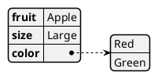

# Plantuml 

* [mdbook-plantuml](https://github.com/sytsereitsma/mdbook-plantuml)
* [Plantuml Command (Docker)](https://github.com/miy4/docker-plantuml)

```plantuml
@startuml
A --|> B
@enduml
```

```plantuml
@startjson
{
   "fruit":"Apple",
   "size":"Large",
   "color": ["Red", "Green"]
}
@endjson
```
